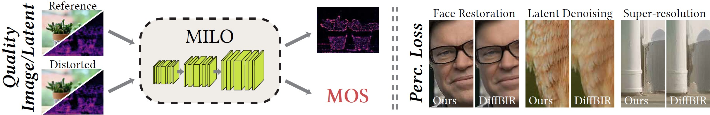

## MILO



This is the official repository for:

**MILO: A Lightweight Perceptual Quality Metric for Image and Latent-Space Optimization**  
*Ugur Çoğalan, Mojtaba Bemana, Karol Myszkowski, Hans-Peter Seidel, Colin Groth*  
*ACM Transactions on Graphics (TOG), 2025*

🔗 Official Project Page: [milo.mpi-inf.mpg.de](https://milo.mpi-inf.mpg.de)

---


Features 
-------- 
* **Full-Reference Image Quality Assessment (FR-IQA)** 
	* Predicts perceptual quality scores aligned with human judgments. 
	* Outputs both a global MOS score and a spatial visibility map for distortion localization. 
	* Achieves state-of-the-art accuracy with a lightweight, multiscale CNN.
	* Trained using pseudo-MOS labels, eliminating the need for large-scale human annotation.
* **Latent-Space Optimization and Perceptual Loss**
	* Operates directly on VAE-encoded latent representations to guide diffusion-based pipelines.
	* Provides perceptually aligned optimization without repeated decoding into image space.
	* Enables curriculum learning: first restores less critical regions, then focuses on perceptually salient areas.
	* Improves performance in tasks such as denoising, super-resolution, and face restoration.


Usage 
----- 

To run the MILO metric, first clone this repository. Then simply execute:

```bash
python MILO_runner.py --ref images/ref.png --dist images/dist.png
```

* `--ref` : Path to the reference image 
* `--dist`: Path to the distorted/test image 

The output score indicates the perceptual difference: 
* **Score of 0** → perceptually identical images (no visible distortions)
* **Score of 1** → highest possible disruption; extreme perceptible distortions in the test image (compared to the reference)

To run the MILO latent metric:

```bash
python MILO_runner_latent.py --ref latents/ref.npy --dist latents/dist.npy
```

The .npy files contain the latent space representation of the reference and distorted images.

Installation 
------------ 

### Requirements 
* Python 3.8+ 
* [PyTorch](https://pytorch.org) (with CUDA enabled) 
* torchvision 

### Installation Command 
```bash
pip install torch torchvision --index-url https://download.pytorch.org/whl/cu118
```

Citation 
-------- 
If you use MILO in your research, please cite: 
```bibtex
@article{Cogalan2025MILO,
  author    = {Ugur {\c{C}}o{\u{g}}alan and Mojtaba Bemana and Karol Myszkowski and Hans-Peter Seidel and Colin Groth},
  title     = {MILO: A Lightweight Perceptual Quality Metric for Image and Latent-Space Optimization},
  journal   = {ACM Transactions on Graphics (TOG)},
  year      = {2025},
  volume    = {44},
  number    = {6},
  publisher = {ACM},
  doi       = {10.1145/3763340}
}
```

Acknowledgments 
---------------

This project was produced by research at the
**Max Planck Institute for Informatics, Germany**.